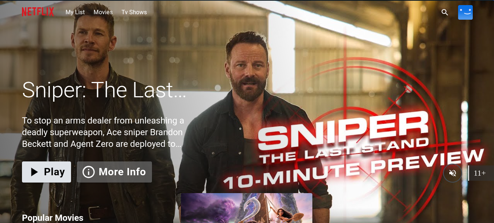
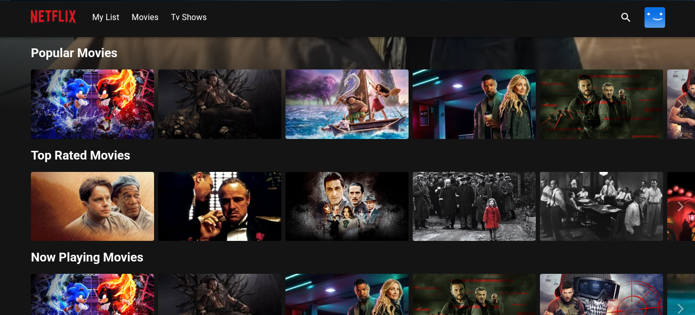
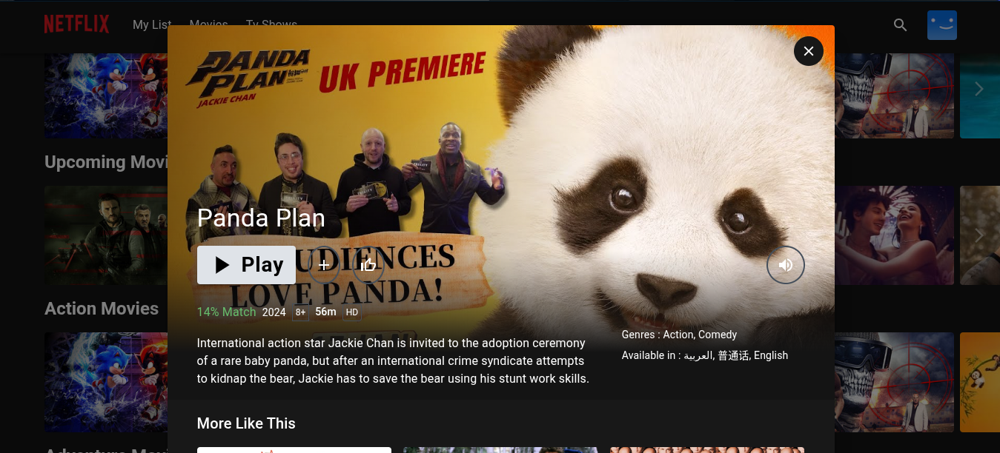
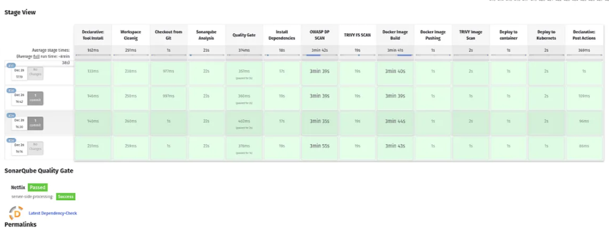

#  Deploying Netflix on Kubernetes with DevSecOps  

##  Project Overview  
This project demonstrates a **secure and scalable deployment of Netflix** on **Kubernetes**, integrating **DevSecOps** best practices. It automates **CI/CD, security scanning, and monitoring** using a modern toolset, ensuring a robust and production-ready environment.  

 **Netfilx Home Page**  
  

 **popular Page**  
  

 **movie Page**  
  

##  Architecture  

The deployment is hosted on **AWS**, with the following infrastructure components:  

1. **Jenkins Server**  
   - Automates CI/CD pipeline for Netflix application deployment  
   - Integrates security tools (**SonarQube, Docker, Trivy, OWASP Dependency-Check**)  

2. **Monitoring Server**  
   - Tracks application and system performance  
   - Uses **Prometheus, Node Exporter, and Grafana**  

3. **Kubernetes Master Server**  
   - Controls the cluster and manages deployments  

4. **Kubernetes Worker Server**  
   - which the application will be deployed by the master node  

 **Infrastructure Diagram:**  
  

---

## 🛠 Tech Stack  

| Category           | Tools & Technologies |
|-------------------|---------------------|
| **Version Control** | Git, GitHub |
| **CI/CD Automation** | Jenkins |
| **Containerization** | Docker, DockerHub |
| **Orchestration** | Kubernetes  |
| **Security Tools** | SonarQube, Trivy, OWASP Dependency-Check |
| **Monitoring & Alerts** | Prometheus, Grafana, Email Notifications |
| **Cloud Provider** | AWS |

---

## 🔄 DevSecOps Pipeline Workflow  

1️⃣ **Developers push code** to GitHub  
2️⃣ **Jenkins triggers the CI/CD pipeline**  
3️⃣ **Code is analyzed** using SonarQube for vulnerabilities  
4️⃣ **Trivy scans the Docker image** for security threats  
5️⃣ **OWASP Dependency-Check** scans libraries for vulnerabilities  
6️⃣ **A secure Docker image is built & pushed to DockerHub**  
7️⃣ **Kubernetes deploys the application** to Worker Nodes  
8️⃣ **Monitoring is handled via Prometheus & Grafana**  
9️⃣ **Email alerts notify the team** of security issues  

 **Jenkins Pipeline Flow:**  
  

---

**Use Case**:  

   - This section highlights real-world scenarios where this project can be applied, such as deploying Netflix-like services or integrating security practices into DevOps pipelines.
   - It shows potential users of the project how this setup can fit into various types of businesses and industries.

🎉 **Conclusion**
This project showcases a secure, automated, and scalable deployment of Netflix on Kubernetes using DevSecOps practices. By integrating CI/CD, security scanning, and monitoring, it ensures a robust and production-ready environment.

Feel free to contribute, raise issues, or suggest improvements!

Happy Deploying! 🚀
